# 🚀 ADKokna CRM — Wdrożenie na nową instancję

Kompletna dokumentacja uruchomienia repozytorium ADKokna CRM na nowym koncie Convex i Vercel.

---

## Spis treści

1. [Wymagania wstępne](#1-wymagania-wstępne)
2. [Krok 1 — Nowy projekt Convex](#2-krok-1--nowy-projekt-convex)
3. [Krok 2 — Zmienne środowiskowe Convex](#3-krok-2--zmienne-środowiskowe-convex)
4. [Krok 3 — Lokalne uruchomienie deweloperskie](#4-krok-3--lokalne-uruchomienie-deweloperskie)
5. [Krok 4 — Nowy projekt Vercel](#5-krok-4--nowy-projekt-vercel)
6. [Krok 5 — Zmienne środowiskowe Vercel](#6-krok-5--zmienne-środowiskowe-vercel)
7. [Krok 6 — Pierwszy deploy i weryfikacja](#7-krok-6--pierwszy-deploy-i-weryfikacja)
8. [Krok 7 — Konfiguracja domeny](#8-krok-7--konfiguracja-domeny)
9. [Krok 8 — Utworzenie pierwszego użytkownika](#9-krok-8--utworzenie-pierwszego-użytkownika)
10. [Krok 9 — Dane testowe (opcjonalnie)](#10-krok-9--dane-testowe-opcjonalnie)
11. [Mapa integracji zewnętrznych](#11-mapa-integracji-zewnętrznych)
12. [Instrukcje przepięcia każdej integracji](#12-instrukcje-przepięcia-każdej-integracji)
13. [Migracja danych ze starej instancji](#13-migracja-danych-ze-starej-instancji)
14. [Checklist wdrożenia](#14-checklist-wdrożenia)

---

## 1. Wymagania wstępne

| Narzędzie | Wersja | Gdzie pobrać |
|---|---|---|
| Node.js | ≥ 18 | https://nodejs.org |
| npm | ≥ 9 | (instaluje się z Node.js) |
| Git | dowolna | https://git-scm.com |
| Convex CLI | ≥ 1.41 | `npm i -g convex` |
| Konto Convex | — | https://dashboard.convex.dev |
| Konto Vercel | — | https://vercel.com |

> [!NOTE]
> Projekt używa **Next.js 16**, **React 19**, **Convex 1.41+**, **@convex-dev/auth** (Password provider), **Tailwind CSS 4** oraz **Sentry**.

---

## 2. Krok 1 — Nowy projekt Convex

### Na dashboard Convex:

1. Zaloguj się na **nowe konto Convex**: https://dashboard.convex.dev
2. Kliknij **„Create a project"**
3. Nadaj nazwę projektu (np. `adkokna-crm`)
4. Wybierz region **EU West 1** (ten sam co oryginał)
5. Zapisz wygenerowane wartości:
   - `CONVEX_DEPLOYMENT` — np. `dev:nowy-projekt-123`
   - `NEXT_PUBLIC_CONVEX_URL` — np. `https://nowy-projekt-123.eu-west-1.convex.cloud`
   - `CONVEX_SITE_URL` (HTTP actions) — np. `https://nowy-projekt-123.eu-west-1.convex.site`

### Lokalnie — zaloguj na nowe konto:

```bash
npx convex logout
npx convex login
```

---

## 3. Krok 2 — Zmienne środowiskowe Convex

W dashboardzie Convex → Settings → Environment Variables, ustaw **WSZYSTKIE** poniższe zmienne:

### Obowiązkowe (core)

| Zmienna | Opis | Skąd wziąć |
|---|---|---|
| `ENCRYPTION_KEY` | Klucz AES-256-GCM do szyfrowania tokenów OAuth | `openssl rand -hex 32` |

> [!CAUTION]
> `ENCRYPTION_KEY` jest krytyczny — szyfruje tokeny Google Drive i Gmail. **Jeśli utracisz ten klucz, wszystkie zapisane połączenia OAuth będą nieczytelne** i trzeba będzie je autoryzować ponownie. Każda nowa instancja musi mieć NOWY unikalny klucz.

### Google OAuth (Drive + Gmail)

| Zmienna | Opis |
|---|---|
| `GOOGLE_CLIENT_ID` | Client ID z Google Cloud Console |
| `GOOGLE_CLIENT_SECRET` | Client Secret z Google Cloud Console |

### JotForm (formularze lead capture)

| Zmienna | Opis |
|---|---|
| `JOTFORM_API_KEY` | Klucz API JotForm |
| `JOTFORM_FORM_ID` | ID formularza JotForm |
| `JOTFORM_WEBHOOK_SECRET` | Sekret do weryfikacji webhooków JotForm |

### SMSAPI (wysyłka SMS)

| Zmienna | Opis |
|---|---|
| `SMSAPI_TOKEN` | Token dostępu do smsapi.pl |

### Google Maps

| Zmienna | Opis |
|---|---|
| `GOOGLE_MAPS_API_KEY` | Klucz API Google Places / Geocoding |

### Fakturownia (faktury)

| Zmienna | Opis |
|---|---|
| `FAKTUROWNIA_API_TOKEN` | Token API Fakturownia.pl |
| `FAKTUROWNIA_SUBDOMAIN` | Subdomena konta (np. `mojakonto`) |

### Anthropic AI (klasyfikacja emaili)

| Zmienna | Opis |
|---|---|
| `ANTHROPIC_API_KEY` | Klucz API Claude (Anthropic) |

### Sentry (monitoring backendu Convex)

| Zmienna | Opis |
|---|---|
| `SENTRY_DSN` | DSN projektu Sentry (backend Convex) |

### Opcjonalne

| Zmienna | Opis |
|---|---|
| `APP_URL` | URL frontendowej aplikacji (np. `https://crm.adkokna.pl`) — używany w OAuth callbackach |

> [!TIP]
> Możesz ustawić zmienne z linii poleceń:
> ```bash
> npx convex env set ENCRYPTION_KEY $(openssl rand -hex 32)
> npx convex env set GOOGLE_CLIENT_ID "twoj-client-id"
> npx convex env set SMSAPI_TOKEN "twoj-token"
> # itd.
> ```

> [!NOTE]
> Projekt **nie używa już Clerka** — został zmigrowany na `@convex-dev/auth` z Password providerem.
> W repozytorium mogą istnieć resztki starej konfiguracji Clerka (np. `.vercel/.env.production.local` z `CLERK_SECRET_KEY`).
> **Ignoruj te zmienne** — nie są potrzebne na nowej instancji.

---

## 4. Krok 3 — Lokalne uruchomienie deweloperskie

### Zaktualizuj `.env.local`:

```bash
# Deployment used by `npx convex dev`
CONVEX_DEPLOYMENT=dev:nowy-projekt-123

NEXT_PUBLIC_CONVEX_URL=https://nowy-projekt-123.eu-west-1.convex.cloud

NEXT_PUBLIC_CONVEX_SITE_URL=https://nowy-projekt-123.eu-west-1.convex.site

NEXT_PUBLIC_DASHBOARD_PIN=3322
```

### Zainstaluj zależności i uruchom:

```bash
npm install
npm run dev
```

To uruchamia równolegle:
- **Next.js** (frontend) — `localhost:3000`
- **Convex dev** (backend) — synchronizuje schemat i funkcje z dashboardem

> [!IMPORTANT]
> Przy pierwszym uruchomieniu `convex dev` automatycznie wdroży schemat bazy danych (`convex/schema.ts`) na nową instancję. Baza będzie pusta.

> [!TIP]
> Projekt zawiera skrypt [dev.sh](file:///Users/wojtekzapora/Documents/venturebox/Projekty/ADKokna/dev.sh), który automatyzuje logowanie do GitHub i Convex, oraz wyświetla domyślne credentiale deweloperskie.
> Możesz go użyć zamiast `npm run dev`:
> ```bash
> chmod +x dev.sh && ./dev.sh
> ```

---

## 5. Krok 4 — Nowy projekt Vercel

1. Idź do https://vercel.com/new
2. Zaimportuj repozytorium Git (GitHub/GitLab)
3. Vercel automatycznie rozpozna framework **Next.js**
4. **Nie klikaj jeszcze „Deploy"** — najpierw ustaw zmienne środowiskowe

### Kluczowe ustawienia w Vercel:

| Ustawienie | Wartość |
|---|---|
| Framework | Next.js |
| Build Command | `npx convex deploy --cmd 'next build'` |
| Install Command | `npm install` |
| Output Directory | `.next` |

> [!NOTE]
> Te ustawienia są już zdefiniowane w [vercel.json](file:///Users/wojtekzapora/Documents/venturebox/Projekty/ADKokna/vercel.json), Vercel powinien je odczytać automatycznie.

---

## 6. Krok 5 — Zmienne środowiskowe Vercel

W Vercel → Settings → Environment Variables, ustaw:

### Convex (obowiązkowe)

| Zmienna | Wartość | Środowiska |
|---|---|---|
| `CONVEX_DEPLOY_KEY` | Klucz deploy z Convex Dashboard → Deployment → Deploy Keys | Production, Preview |
| `NEXT_PUBLIC_CONVEX_URL` | `https://nowy-projekt-123.eu-west-1.convex.cloud` | Wszystkie |
| `NEXT_PUBLIC_CONVEX_SITE_URL` | `https://nowy-projekt-123.eu-west-1.convex.site` | Wszystkie |
| `NEXT_PUBLIC_DASHBOARD_PIN` | PIN do dashboardu (np. `3322`) | Wszystkie |

### Sentry (monitoring frontendu)

| Zmienna | Wartość |
|---|---|
| `NEXT_PUBLIC_SENTRY_DSN` | DSN projektu Sentry (frontend, klient) |
| `SENTRY_ORG` | Nazwa organizacji w Sentry |
| `SENTRY_PROJECT` | Nazwa projektu w Sentry |
| `SENTRY_AUTH_TOKEN` | Auth token Sentry do uploadu source map |

> [!TIP]
> Jeśli nie używasz Sentry, te zmienne możesz pominąć — system działa bez nich, tylko bez monitoringu błędów.

---

## 7. Krok 6 — Pierwszy deploy i weryfikacja

```bash
# Lokalnie — ręczny deploy do produkcji
npx convex deploy --cmd 'next build'
```

Lub z Vercel — wystarczy push do głównego brancha, Vercel automatycznie zrobi deploy.

### Co sprawdzić po deployu:

- [ ] Strona logowania wyświetla się poprawnie
- [ ] Convex Dashboard pokazuje wdrożone tabele i funkcje
- [ ] HTTP endpointy działają (np. `{CONVEX_SITE_URL}/api/public/services`)
- [ ] Cron job (Google Drive health check) jest widoczny w dashboardzie Convex

---

## 8. Krok 7 — Konfiguracja domeny

Jeśli chcesz używać custom domeny (np. `crm.adkokna.pl`):

1. W Vercel → Settings → Domains → dodaj domenę
2. Skonfiguruj DNS (CNAME lub A record) według instrukcji Vercel
3. Ustaw `APP_URL` w zmiennych Convex na nową domenę

---

## 9. Krok 8 — Utworzenie pierwszego użytkownika

System używa **@convex-dev/auth z Password providerem**. Publiczna rejestracja jest **wyłączona** — nowe konta tworzy wyłącznie admin.

### Pierwszy użytkownik — z poziomu Convex Dashboard:

1. Otwórz Convex Dashboard → Functions
2. Uruchom odpowiednią mutację do utworzenia konta (np. `users.createUser`)
3. Ustaw rolę `admin` dla pierwszego użytkownika

> [!IMPORTANT]
> Bez konta admin nie będzie można zarządzać systemem. Upewnij się, że pierwszy użytkownik ma rolę `admin`.

---

## 10. Krok 9 — Dane testowe (opcjonalnie)

Projekt zawiera funkcję seed do wygenerowania danych demonstracyjnych:

```bash
# Z Convex Dashboard → Functions → seed.seedDemoData → Run
```

Lub z kodu:
```ts
// Uruchom jednorazowo
await ctx.runMutation(api.seed.seedDemoData, {});
```

---

## 11. Mapa integracji zewnętrznych

```mermaid
graph TB
    subgraph "ADKokna CRM"
        CRM["ADKokna CRM<br/>(Next.js + Convex)"]
    end

    subgraph "Hosting i Infrastruktura"
        VCL["Vercel<br/>Frontend hosting"]
        CVX["Convex<br/>Backend + DB"]
        SNT["Sentry<br/>Monitoring błędów"]
    end

    subgraph "Autentykacja"
        AUTH["@convex-dev/auth<br/>Password provider"]
    end

    subgraph "Google Workspace"
        GD["Google Drive<br/>Pliki i dokumenty"]
        GM["Gmail<br/>Wysyłka/odbiór email"]
        GP["Google Places<br/>Autouzupełnianie adresów"]
    end

    subgraph "Formularze"
        JF["JotForm<br/>Formularz zgłoszeniowy"]
        WW["Strona WWW<br/>Webhook formularza"]
    end

    subgraph "Komunikacja"
        SMS["SMSAPI.pl<br/>Wysyłka SMS"]
    end

    subgraph "Finanse"
        FKT["Fakturownia.pl<br/>Faktury VAT"]
        WL["Biała Lista MF<br/>Weryfikacja NIP"]
    end

    subgraph "AI"
        ANT["Anthropic Claude<br/>Klasyfikacja emaili"]
    end

    subgraph "Powiązane projekty"
        EXL["Exalco / ALCO CRM<br/>Zarządzanie zleceniami dostawcy"]
        WWW["Strona ADKokna.pl<br/>Publiczna strona WWW"]
    end

    CRM --> VCL
    CRM --> CVX
    CRM --> SNT
    CRM --> AUTH
    CRM <--> GD
    CRM <--> GM
    CRM --> GP
    CRM <-- "webhook" --> JF
    CRM <-- "webhook" --> WW
    CRM --> SMS
    CRM <--> FKT
    CRM --> WL
    CRM --> ANT
    CRM <-- "API + webhook" --> EXL
    WWW -- "formularz + usługi" --> CRM
```



---

## 12. Instrukcje przepięcia każdej integracji

### 12.1 Google Drive

| Element | Działanie |
|---|---|
| **Co robi** | Przechowywanie plików klientów, dokumentów zleceń. OAuth2 do konta Google firmy |
| **Pliki** | [googleDrive.ts](file:///Users/wojtekzapora/Documents/venturebox/Projekty/ADKokna/convex/googleDrive.ts), [googleDriveAuth.ts](file:///Users/wojtekzapora/Documents/venturebox/Projekty/ADKokna/convex/googleDriveAuth.ts) |
| **Zmienne** | `GOOGLE_CLIENT_ID`, `GOOGLE_CLIENT_SECRET`, `ENCRYPTION_KEY` |
| **Cron** | Health check co 30 min ([crons.ts](file:///Users/wojtekzapora/Documents/venturebox/Projekty/ADKokna/convex/crons.ts)) |

**Jak przepiąć:**

1. W [Google Cloud Console](https://console.cloud.google.com):
   - Utwórz nowy projekt lub użyj istniejącego
   - Włącz API: **Google Drive API**, **Google Docs API**
   - Utwórz OAuth 2.0 credentials (Web application)
   - Dodaj **Authorized redirect URI**: `{NOWY_CONVEX_SITE_URL}/api/google-drive/callback`
2. Ustaw `GOOGLE_CLIENT_ID` i `GOOGLE_CLIENT_SECRET` w zmiennych Convex
3. Po deployu — w panelu CRM idź do **Ustawienia → Google Drive** i ponownie autoryzuj konto

> [!CAUTION]
> W pliku [googleDrive.ts](file:///Users/wojtekzapora/Documents/venturebox/Projekty/ADKokna/convex/googleDrive.ts) są **hardcodowane ID folderów Shared Drive**:
> ```ts
> const CLIENTS_FOLDER_ID = "0AF5F7v0YZWQHUk9PVA";
> const TEMPLATES_FOLDER_ID = "0ANuZnSEtUiLTUk9PVA";
> ```
> Jeśli korzystasz z **innego konta Google Workspace / Shared Drive**, musisz te wartości zaktualizować na nowe ID folderów. Jeśli konto jest to samo, wartości zostawiasz bez zmian.

> [!WARNING]
> Tokeny OAuth z poprzedniej instancji **nie zadziałają** — są zaszyfrowane innym `ENCRYPTION_KEY`. Trzeba autoryzować konto ponownie.

---

### 12.2 Gmail

| Element | Działanie |
|---|---|
| **Co robi** | Wysyłanie i odbieranie emaili, klasyfikacja AI, oferty email |
| **Pliki** | [gmail.ts](file:///Users/wojtekzapora/Documents/venturebox/Projekty/ADKokna/convex/gmail.ts), [gmailAuth.ts](file:///Users/wojtekzapora/Documents/venturebox/Projekty/ADKokna/convex/gmailAuth.ts), [emailClassification.ts](file:///Users/wojtekzapora/Documents/venturebox/Projekty/ADKokna/convex/emailClassification.ts), [offerEmails.ts](file:///Users/wojtekzapora/Documents/venturebox/Projekty/ADKokna/convex/offerEmails.ts) |
| **Zmienne** | `GOOGLE_CLIENT_ID`, `GOOGLE_CLIENT_SECRET`, `ENCRYPTION_KEY`, `ANTHROPIC_API_KEY` |

**Jak przepiąć:**

1. W tym samym projekcie Google Cloud co Drive:
   - Włącz API: **Gmail API**
   - Dodaj **Authorized redirect URI**: `{NOWY_CONVEX_SITE_URL}/api/gmail/callback`
2. Scope OAuth: `https://mail.google.com/ email profile`
3. W panelu CRM → **Mail** → ponownie autoryzuj konto Gmail
4. Ustaw `ANTHROPIC_API_KEY` dla klasyfikacji emaili (Claude AI)

---

### 12.3 JotForm (formularze leadowe)

| Element | Działanie |
|---|---|
| **Co robi** | Przyjmuje zgłoszenia z formularza JotForm → tworzy klientów i szanse sprzedaży |
| **Pliki** | [jotform.ts](file:///Users/wojtekzapora/Documents/venturebox/Projekty/ADKokna/convex/jotform.ts), [jotformAdmin.ts](file:///Users/wojtekzapora/Documents/venturebox/Projekty/ADKokna/convex/jotformAdmin.ts), [jotformInternal.ts](file:///Users/wojtekzapora/Documents/venturebox/Projekty/ADKokna/convex/jotformInternal.ts) |
| **Zmienne** | `JOTFORM_API_KEY`, `JOTFORM_FORM_ID`, `JOTFORM_WEBHOOK_SECRET` |
| **Endpoint HTTP** | `POST {CONVEX_SITE_URL}/api/webhooks/jotform` |

**Jak przepiąć:**

1. W [JotForm](https://www.jotform.com):
   - Idź do formularza → Settings → Integrations → Webhooks
   - Zmień URL webhooka na: `{NOWY_CONVEX_SITE_URL}/api/webhooks/jotform`
2. Ustaw zmienne w Convex: `JOTFORM_API_KEY`, `JOTFORM_FORM_ID`, `JOTFORM_WEBHOOK_SECRET`
3. Przetestuj wysyłając testowy formularz

---

### 12.4 Exalco / ALCO CRM (dwukierunkowa integracja)

| Element | Działanie |
|---|---|
| **Co robi** | Wysyła zamówienia do systemu CRM dostawcy (Exalco), odbiera statusy i daty dostawy przez webhook |
| **Pliki** | [crmIntegration.ts](file:///Users/wojtekzapora/Documents/venturebox/Projekty/ADKokna/convex/crmIntegration.ts), [exalcoWebhook.ts](file:///Users/wojtekzapora/Documents/venturebox/Projekty/ADKokna/convex/exalcoWebhook.ts) |
| **Endpoint HTTP** | `POST {CONVEX_SITE_URL}/api/webhooks/exalco` |

**Jak przepiąć:**

1. **W panelu CRM ADKokna:**
   - Dodaj dostawcę (Suppliers) z `apiEndpoint` i `apiKey` wskazującymi na instancję Exalco
   - Zaznacz `isApiEnabled: true`

2. **W systemie Exalco/ALCO:**
   - Zaktualizuj **webhook callback URL** na: `{NOWY_CONVEX_SITE_URL}/api/webhooks/exalco`
   - Ten URL jest też automatycznie wysyłany w polu `webhookUrl` przy tworzeniu zamówienia

3. **Komunikacja dwustronna:**
   - ADKokna → Exalco: `POST /api/partner/orders` (tworzenie zamówienia)
   - ADKokna → Exalco: `POST /api/partner/orders/add-note` (dodawanie notatek)
   - ADKokna → Exalco: `POST /api/partner/orders/upload-file` (wysyłanie plików)
   - Exalco → ADKokna: `POST /api/webhooks/exalco` (statusy, daty dostawy, notatki)

> [!CAUTION]
> W pliku [crmIntegration.ts](file:///Users/wojtekzapora/Documents/venturebox/Projekty/ADKokna/convex/crmIntegration.ts#L51) jest **hardcodowany fallback URL**:
> ```ts
> const siteUrl = process.env.NEXT_PUBLIC_CONVEX_SITE_URL || "https://fearless-firefly-85.eu-west-1.convex.site";
> ```
> **Musisz ustawić** zmienną `NEXT_PUBLIC_CONVEX_SITE_URL` w Convex env, aby webhook URL prowadził do nowej instancji, a nie do starej!

---

### 12.5 Strona WWW ADKokna (webhook formularza + publiczne API)

| Element | Działanie |
|---|---|
| **Co robi** | Strona WWW wysyła zgłoszenia formularzowe do CRM + pobiera listę aktywnych usług |
| **Pliki** | [websiteWebhook.ts](file:///Users/wojtekzapora/Documents/venturebox/Projekty/ADKokna/convex/websiteWebhook.ts), [publicApi.ts](file:///Users/wojtekzapora/Documents/venturebox/Projekty/ADKokna/convex/publicApi.ts) |
| **Endpointy HTTP** | `POST {CONVEX_SITE_URL}/api/webhooks/website`, `GET {CONVEX_SITE_URL}/api/public/services`, `POST {CONVEX_SITE_URL}/api/public/generate-upload-url` |

**Jak przepiąć:**

1. W kodzie strony WWW ADKokna (oddzielny projekt):
   - Zmień URL API z `https://fearless-firefly-85.eu-west-1.convex.site` na `{NOWY_CONVEX_SITE_URL}`
   - Dotyczy endpointów:
     - Formularz kontaktowy → `POST /api/webhooks/website`
     - Lista usług → `GET /api/public/services`
     - Upload plików → `POST /api/public/generate-upload-url`

---

### 12.6 SMSAPI.pl (SMS)

| Element | Działanie |
|---|---|
| **Co robi** | Wysyłka SMS z adresami klientów i adresami inwestycji do ekip montażowych |
| **Pliki** | [sms.ts](file:///Users/wojtekzapora/Documents/venturebox/Projekty/ADKokna/convex/sms.ts) |
| **Zmienne** | `SMSAPI_TOKEN` |
| **API** | `https://api.smsapi.pl/sms.do` |

**Jak przepiąć:**

1. Możesz użyć **tego samego konta SMSAPI** — wystarczy skopiować token
2. Lub utwórz nowe konto na [smsapi.pl](https://www.smsapi.pl)
3. Ustaw `SMSAPI_TOKEN` w zmiennych Convex
4. Konfiguracja nadawcy i odbiorców jest w bazie (tabela `smsConfig`) — ustaw w panelu CRM

---

### 12.7 Fakturownia.pl (faktury)

| Element | Działanie |
|---|---|
| **Co robi** | Tworzenie, przeglądanie i zarządzanie fakturami VAT (zaliczka, końcowa, zwykła) |
| **Pliki** | [fakturownia.ts](file:///Users/wojtekzapora/Documents/venturebox/Projekty/ADKokna/convex/fakturownia.ts) |
| **Zmienne** | `FAKTUROWNIA_API_TOKEN`, `FAKTUROWNIA_SUBDOMAIN` |
| **API** | `https://{subdomain}.fakturownia.pl` |

**Jak przepiąć:**

1. Użyj tego samego konta Fakturownia lub stwórz nowe
2. Wygeneruj nowy API token w Fakturownia → Ustawienia → API
3. Ustaw obie zmienne w Convex
4. Konfiguracja jest też dostępna w panelu CRM (tabela `fakturowniaConfig`)

---

### 12.8 Google Maps / Places API

| Element | Działanie |
|---|---|
| **Co robi** | Autouzupełnianie adresów klientów, geokodowanie |
| **Pliki** | [places.ts](file:///Users/wojtekzapora/Documents/venturebox/Projekty/ADKokna/convex/places.ts) |
| **Zmienne** | `GOOGLE_MAPS_API_KEY` |

**Jak przepiąć:**

1. W Google Cloud Console włącz: **Places API (New)**, **Geocoding API**
2. Utwórz lub skopiuj klucz API
3. Ogranicz klucz do dozwolonych API i domen (opcjonalnie)
4. Ustaw `GOOGLE_MAPS_API_KEY` w Convex

---

### 12.9 Biała Lista MF (Ministerstwo Finansów)

| Element | Działanie |
|---|---|
| **Co robi** | Weryfikacja NIP klientów firmowych — pobiera dane firmy i status VAT |
| **Pliki** | [whitelist.ts](file:///Users/wojtekzapora/Documents/venturebox/Projekty/ADKokna/convex/whitelist.ts) |
| **API** | `https://wl-api.mf.gov.pl/api/search/nip/` |

**Jak przepiąć:**

✅ **Nie wymaga konfiguracji** — API Białej Listy MF jest publiczne i bezpłatne. Działa automatycznie.

---

### 12.10 Anthropic Claude (AI)

| Element | Działanie |
|---|---|
| **Co robi** | Automatyczna klasyfikacja emaili (LEAD / OTHER) |
| **Pliki** | [emailClassification.ts](file:///Users/wojtekzapora/Documents/venturebox/Projekty/ADKokna/convex/emailClassification.ts) |
| **Zmienne** | `ANTHROPIC_API_KEY` |

**Jak przepiąć:**

1. Utwórz klucz API na https://console.anthropic.com
2. Ustaw `ANTHROPIC_API_KEY` w Convex

> [!NOTE]
> Projekt ma też wbudowany asystent AI ([aiAssistant.ts](file:///Users/wojtekzapora/Documents/venturebox/Projekty/ADKokna/convex/aiAssistant.ts)) z konfigurowalnym kluczem API i modelem — te są zapisane w bazie danych (tabela `aiAssistantConfig`), nie w zmiennych środowiskowych.

---

### 12.11 Sentry (monitoring błędów)

| Element | Działanie |
|---|---|
| **Co robi** | Monitoring błędów frontendu (Next.js) i backendu (Convex actions) |
| **Pliki** | [sentry.client.config.ts](file:///Users/wojtekzapora/Documents/venturebox/Projekty/ADKokna/sentry.client.config.ts), [sentry.edge.config.ts](file:///Users/wojtekzapora/Documents/venturebox/Projekty/ADKokna/sentry.edge.config.ts), [sentry.server.config.ts](file:///Users/wojtekzapora/Documents/venturebox/Projekty/ADKokna/sentry.server.config.ts), [convex/lib/sentry.ts](file:///Users/wojtekzapora/Documents/venturebox/Projekty/ADKokna/convex/lib/sentry.ts) |

**Zmienne Vercel (frontend):**

| Zmienna | Opis |
|---|---|
| `NEXT_PUBLIC_SENTRY_DSN` | DSN kliencki |
| `SENTRY_ORG` | Organizacja Sentry |
| `SENTRY_PROJECT` | Projekt Sentry |
| `SENTRY_AUTH_TOKEN` | Token do uploadu source map |

**Zmienne Convex (backend):**

| Zmienna | Opis |
|---|---|
| `SENTRY_DSN` | DSN backendowy |

**Jak przepiąć:**

1. Utwórz nowy projekt w [Sentry](https://sentry.io) lub użyj istniejącego
2. Skopiuj DSN z Project Settings → Client Keys
3. Wygeneruj Auth Token z Settings → API → Tokens (scope: `project:releases`, `org:read`)
4. Ustaw zmienne w Vercel i Convex

---

## 13. Migracja danych ze starej instancji

> [!WARNING]
> Pliki przechowywane w Convex Storage (PDFs, obrazy, załączniki) **nie migrują się automatycznie**. Są przywiązane do konkretnego deployment.

### Opcje migracji danych:

#### A. Eksport / Import z dashboardu Convex
1. Na **starej** instancji → Dashboard → Data → Export (snapshot)
2. Na **nowej** instancji → Dashboard → Data → Import
3. **Uwaga:** ID dokumentów się zmienią

#### B. Moduł backupów wbudowany w CRM
Projekt posiada moduł [backups.ts](file:///Users/wojtekzapora/Documents/venturebox/Projekty/ADKokna/convex/backups.ts) umożliwiający eksport/import danych z poziomu panelu admina.

#### C. Świeża instancja (bez migracji)
Jeśli chcesz zacząć od zera — po prostu uruchom system bez importu. Opcjonalnie uruchom `seed.seedDemoData` do wgrania danych testowych.

### Co NIE migruje się automatycznie:
- Tokeny OAuth (Google Drive, Gmail) — trzeba ponownie autoryzować
- Pliki w Convex Storage
- Konfiguracja AI assistanta (apiKey w tabeli `aiAssistantConfig`)
- Konfiguracja SMS (tabela `smsConfig`)
- Konfiguracja Fakturownia (tabela `fakturowniaConfig`)

---

## 14. Checklist wdrożenia

### Infrastruktura

- [ ] Nowe konto Convex założone i projekt utworzony
- [ ] Nowy projekt Vercel założony i połączony z repozytorium
- [ ] `.env.local` zaktualizowany
- [ ] Domena skonfigurowana (opcjonalnie)

### Zmienne środowiskowe — Convex Dashboard

- [ ] `ENCRYPTION_KEY` — wygenerowany i ustawiony
- [ ] `GOOGLE_CLIENT_ID` — ustawiony
- [ ] `GOOGLE_CLIENT_SECRET` — ustawiony
- [ ] `GOOGLE_MAPS_API_KEY` — ustawiony
- [ ] `SMSAPI_TOKEN` — ustawiony
- [ ] `JOTFORM_API_KEY` — ustawiony
- [ ] `JOTFORM_FORM_ID` — ustawiony
- [ ] `JOTFORM_WEBHOOK_SECRET` — ustawiony
- [ ] `FAKTUROWNIA_API_TOKEN` — ustawiony
- [ ] `FAKTUROWNIA_SUBDOMAIN` — ustawiony
- [ ] `ANTHROPIC_API_KEY` — ustawiony
- [ ] `SENTRY_DSN` — ustawiony (opcjonalnie)
- [ ] `APP_URL` — ustawiony (opcjonalnie)

### Zmienne środowiskowe — Vercel

- [ ] `CONVEX_DEPLOY_KEY` — ustawiony
- [ ] `NEXT_PUBLIC_CONVEX_URL` — ustawiony
- [ ] `NEXT_PUBLIC_CONVEX_SITE_URL` — ustawiony
- [ ] `NEXT_PUBLIC_DASHBOARD_PIN` — ustawiony
- [ ] `NEXT_PUBLIC_SENTRY_DSN` — ustawiony (opcjonalnie)
- [ ] `SENTRY_ORG` — ustawiony (opcjonalnie)
- [ ] `SENTRY_PROJECT` — ustawiony (opcjonalnie)
- [ ] `SENTRY_AUTH_TOKEN` — ustawiony (opcjonalnie)

### Google Cloud Console

- [ ] OAuth 2.0 credentials utworzone
- [ ] Redirect URIs dodane:
  - [ ] `{CONVEX_SITE_URL}/api/google-drive/callback`
  - [ ] `{CONVEX_SITE_URL}/api/gmail/callback`
- [ ] Włączone API: Drive, Docs, Gmail, Places, Geocoding

### Integracje zewnętrzne

- [ ] JotForm — webhook URL zaktualizowany
- [ ] Exalco/ALCO — webhook callback URL zaktualizowany
- [ ] Strona WWW ADKokna — URL endpointów API zaktualizowane
- [ ] Google Drive — konto ponownie autoryzowane w CRM
- [ ] Gmail — konto ponownie autoryzowane w CRM
- [ ] Dostawcy (Suppliers) — apiEndpoint i apiKey ustawione w CRM

### Hardcodowane wartości do sprawdzenia

- [ ] `crmIntegration.ts` linia 51 — fallback URL wskazuje starą instancję, ustaw `NEXT_PUBLIC_CONVEX_SITE_URL`
- [ ] `sms.ts` — domyślny telefon wewnętrzny `48515453090` i nadawca `Grupa ADK` — zmień w panelu CRM jeśli potrzeba
- [ ] `paymentReminders.ts` — hardcodowany numer konta bankowego `77 1240 2702 1111 0011 0284 4073`
- [ ] `offerEmails.ts` — domyślne CC na `aluminiumadk@gmail.com`
- [ ] `googleDrive.ts` — hardcodowane ID folderów Shared Drive (`CLIENTS_FOLDER_ID`, `TEMPLATES_FOLDER_ID`)
- [ ] `CityDistance.tsx` — współrzędne bazy firmy (Mińsk Mazowiecki: `52.1765, 21.5594`)
- [ ] `app/nowa-szansa/layout.tsx` — identyfikator Google Analytics `G-L4NHZY2BKN`
- [ ] Strona frontendu zamienia `NEXT_PUBLIC_CONVEX_URL` (`.cloud` → `.site`) do generowania linków do plików JotForm

### Weryfikacja

- [ ] Logowanie do panelu działa
- [ ] PinGate — zmienna `NEXT_PUBLIC_DASHBOARD_PIN` ustawiona
- [ ] Formularz JotForm tworzy nowego klienta
- [ ] Formularz na WWW tworzy zgłoszenie
- [ ] SMS wysyła się poprawnie
- [ ] Google Drive jest połączony
- [ ] Gmail jest połączony i może wysyłać email
- [ ] Fakturownia tworzy faktury
- [ ] Exalco — zamówienie się wysyła i webhook wraca
- [ ] Klasyfikacja emaili AI działa
- [ ] Sentry odbiera błędy (opcjonalnie)

---

> [!TIP]
> Po wdrożeniu zalecam uruchomienie `npm test` lokalnie, aby zweryfikować, że testy backendowe przechodzą na nowej instancji.

---

*Dokumentacja wygenerowana na podstawie analizy repozytorium ADKokna CRM. Data: 2026-09-18.*
